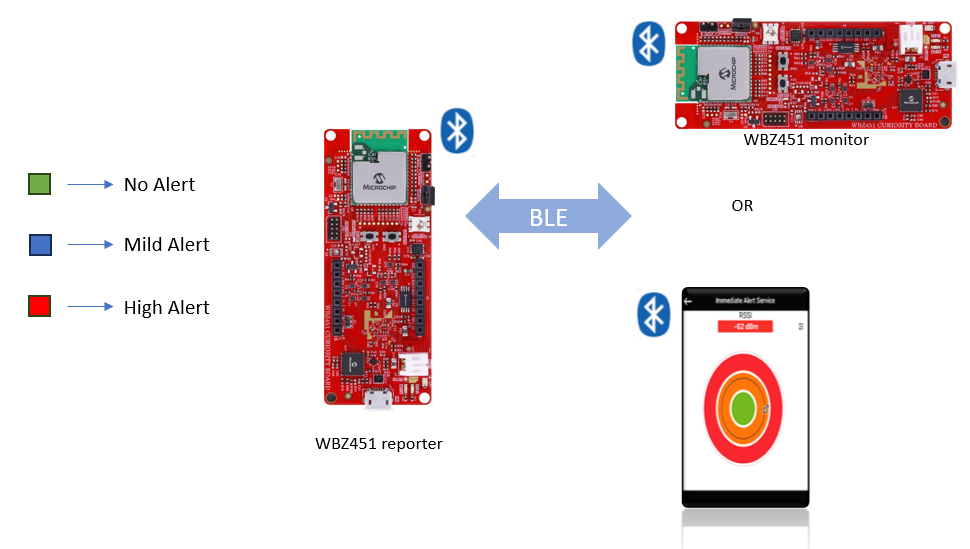
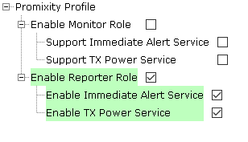
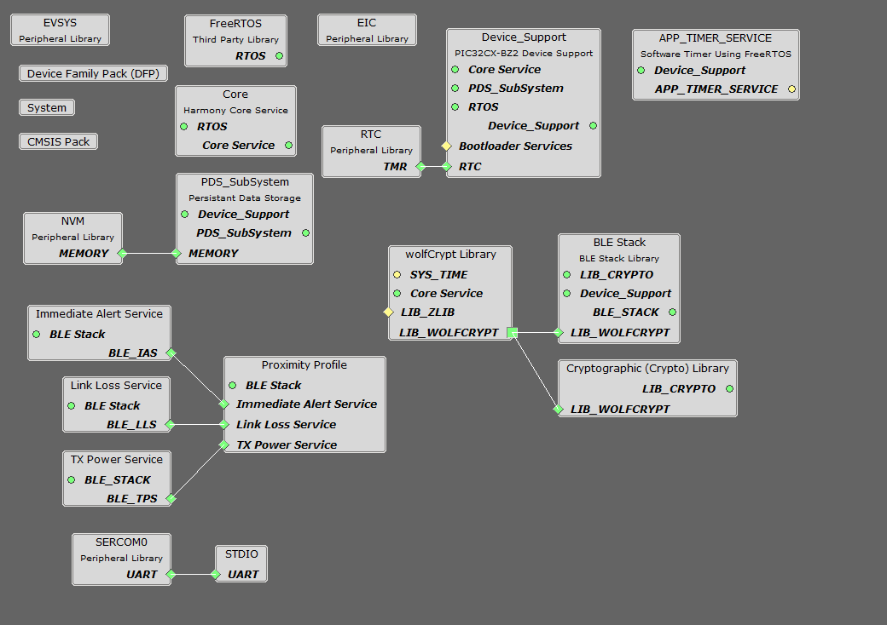
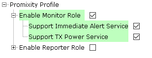
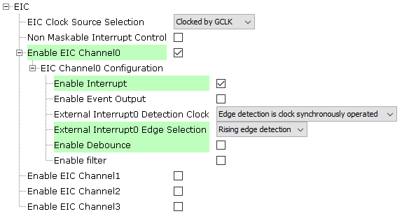
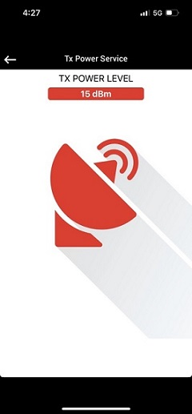

# PIC32CXBZ2_WBZ45x BLE Proximity Profile

> "IoT Made Easy!" 

Devices: **| PIC32CXBZ2 | WBZ45x |** 
Features: **| BLE |**

## ⚠ Disclaimer

<b>
THE SOFTWARE ARE PROVIDED "AS IS" AND GIVE A PATH FOR SELF-SUPPORT AND SELF-MAINTENANCE. This repository contains example code intended to help accelerate client product development.  

For additional Microchip repos, see: <a href="https://github.com/Microchip-MPLAB-Harmony" target="_blank">https://github.com/Microchip-MPLAB-Harmony</a>

Checkout the <a href="https://microchipsupport.force.com/s/" target="_blank">Technical support portal</a> to access our knowledge base, community forums or submit support ticket requests.

</b>

## Contents

1. [Introduction](#step1)
1. [Bill of materials](#step2)
1. [Software Setup](#step4)
1. [Harmony MCC Configuration](#step5)
1. [Board Programming](#step6)
1. [Run the demo](#step7)

## 1. Introduction<a name="step1">

This application demonstrates on how to create a BLE Proximity monitor and Proximity reporter application on WBZ451 Curiosity board. This application also illustrates the use of the Services provided by the Proximity profile.

## 2. Bill of materials<a name="step2">

| TOOLS | QUANTITY |
| :- | :- |
| [PIC32CX-BZ2 and WBZ451 Curiosity Development Board](https://www.microchip.com/en-us/development-tool/EV96B94A) | 2 |

## 3. Software Setup<a name="step4">

- [MPLAB X IDE ](https://www.microchip.com/en-us/tools-resources/develop/mplab-x-ide#tabs)

    - Version: 6.10
	- XC32 Compiler v4.10
	- MPLAB® Code Configurator v5.1.17
	- PIC32CX-BZ_DFP v1.1.218
	- MCC Harmony
	  - csp version: v3.13.1
	  - core version: v3.11.1
	  - CMSIS-FreeRTOS: v10.4.6
	  - dev_packs: v3.13.0
	  - wolfssl version: v4.7.0
	  - crypto version: v3.7.6
	  - wireless_pic32cxbz_wbz: v1.1.0
	  - wireless_ble: v1.1.0

- Any Serial Terminal application like [TERA TERM](https://download.cnet.com/Tera-Term/3000-2094_4-75766675.html) terminal application

- [MPLAB X IPE v6.10](https://microchipdeveloper.com/ipe:installation)

- [Microchip Bluetooth Data (MBD app)](https://play.google.com/store/apps/details?id=com.microchip.bluetooth.data&hl=en&gl=US)

## 4. Harmony MCC Configuration<a name="step5">

### Getting started with Proximity Reporter application in WBZ451 Curiosity board 

| Tip | New users of MPLAB Code Configurator are recommended to go through the [overview](https://onlinedocs.microchip.com/pr/GUID-1F7007B8-9A46-4D03-AEED-650357BA760D-en-US-6/index.html?GUID-B5D058F5-1D0B-4720-8649-ACE5C0EEE2C0) |
| :- | :- |

**Step 1** - Connect the WBZ451 CURIOSITY BOARD to the device/system using a micro-USB cable.

**Step 2** - Create a [new MCC Harmony project](https://github.com/MicrochipTech/EA71C53A/blob/master/H3/wireless_apps_pic32cxbz2_wbz45/apps/docs/creating_new_mplabx_harmony_project.md#creating-a-new-mcc-harmony-project).

**Step 3** - The "MCC - Harmony Project Graph" below depicts the harmony components utilized in this project.

- From Device resources, go to Wireless->Drivers->BLE->Profiles and select Proximity profile. Accept Dependencies or satisfiers, select "Yes". Right click on the "⬦" and add all the services for the profile. The configuration is depicted as follows.

- Select BLE STACK and configure as depicted below.

- From Device resources, go to  Library->Harmony->Peripherals->SERCOM and select SERCOM0. Right click on the "⬦" on UART and select STDIO. The configuration is depicted as follows.

- From project graph, go to Plugins->PIN configuration and configure as follows.

**Step 4** - [Generate](https://onlinedocs.microchip.com/pr/GUID-A5330D3A-9F51-4A26-B71D-8503A493DF9C-en-US-1/index.html?GUID-9C28F407-4879-4174-9963-2CF34161398E) the code.
 
**Step 5** - In "app_user_edits.c", make sure the below code line is commented 

- "#error User action required - manually edit files as described here".

**Step 6** - Copy the mentioned files from this repository by navigating to the location mentioned below and paste it your project folder. 

| Note | This application repository should be cloned/downloaded to perform the following steps. |
| :- | :- |
| Path | firmware/src |

- Copy the "app_ble" folder, "app_timer" folder, "app.c" and "app.h" which can be found by navigating to the following path: "...\firmware\src"
- Paste the folder under source files in your project folder (...\firmware\src).

- In the "app_pxpr_handler", the event for Alert Level in Link Loss Service is written. In the "app_ble_handler.c" file whenever a BLE disconnection happens due to connection timeout an app task is posted to alert the user based on the link loss alert level.

- In the "app_pxpr_handler", the event for Alert Level in Immediate Alert Service is written. And the RGB LED glows based on the alert level.

**Step 7** - Clean and build the project. To run the project, select "Make and program device" button.

### Getting started with Proximity Monitor application in WBZ451 Curiosity board 

| Tip | New users of MPLAB Code Configurator are recommended to go through the [overview](https://onlinedocs.microchip.com/pr/GUID-1F7007B8-9A46-4D03-AEED-650357BA760D-en-US-6/index.html?GUID-B5D058F5-1D0B-4720-8649-ACE5C0EEE2C0) |
| :- | :- |

**Step 1** - Connect the WBZ451 CURIOSITY BOARD to the device/system using a micro-USB cable.

**Step 2** - Create a [new MCC Harmony project](https://github.com/MicrochipTech/EA71C53A/blob/master/H3/wireless_apps_pic32cxbz2_wbz45/apps/docs/creating_new_mplabx_harmony_project.md#creating-a-new-mcc-harmony-project).

**Step 3** - The "MCC - Harmony Project Graph" below depicts the harmony components utilized in this project.

- From Device resources, go to Wireless->Drivers->BLE->Profiles and select Proximity profile. Accept Dependencies or satisfiers, select "Yes". Right click on the "⬦" and add all the services for the profile. The configuration is depicted as follows.

- Select BLE STACK and configure as depicted below.

- From Device resources, go to  Library->Harmony->Peripherals->SERCOM and select SERCOM0. Right click on the "⬦" on UART and select STDIO. The configuration is depicted as follows.

- From Device resources, go to  Library->Harmony->Peripherals and select EIC. Configure as depicted below

- From project graph, go to Plugins->PIN configuration and set RB4 as "EXTINT0".

**Step 4** - [Generate](https://onlinedocs.microchip.com/pr/GUID-A5330D3A-9F51-4A26-B71D-8503A493DF9C-en-US-1/index.html?GUID-9C28F407-4879-4174-9963-2CF34161398E) the code.
 
**Step 5** - In "app_user_edits.c", make sure the below code line is commented and do the mentioned steps.

- "#error User action required - manually edit files as described here".

**Step 6** - Copy the mentioned files from this repository by navigating to the location mentioned below and paste it your project folder. 

| Note | This application repository should be cloned/downloaded to perform the following steps. |
| :- | :- |
| Path | firmware/src |

- Copy the "app_ble" folder, "app_timer" folder, "app.c" and "app.h" which can be found by navigating to the following path: "...\firmware\src"
- Paste the folder under source files in your project folder (...\firmware\src).

- In "app.c", the once the BLE connection is established the pathloss parameters are set. Based on the Pathloss threshold, Hysteresis and the Time spent, the pathloss value between to BLE devices is calculated. Based on this pathloss value the Immediate Alert Service Alert level is written to the reporter. For more details please go through this [link](https://onlinedocs.microchip.com/oxy/GUID-A5330D3A-9F51-4A26-B71D-8503A493DF9C-en-US-3/GUID-02FE54CD-CC0E-45F0-8525-0043B54B828B.html) for understanding pathloss feature in BLE.

**Step 7** - Clean and build the project. To run the project, select "Make and program device" button.

## 5. Board Programming<a name="step6">

### Program the precompiled hex file using MPLAB X IPE

- The application hex file can be found in the hex folder.

- Follow the steps provided in the link to [program the precompiled hex file](https://microchipdeveloper.com/ipe:programming-device) using MPLABX IPE to program the pre-compiled hex image. 

### Build and program the application using MPLAB X IDE

Follow the steps provided in the link to [Build and program the application](https://github.com/Microchip-MPLAB-Harmony/wireless_apps_pic32cxbz2_wbz45/tree/master/apps/ble/advanced_applications/ble_sensor#build-and-program-the-application-guid-3d55fb8a-5995-439d-bcd6-deae7e8e78ad-section).

## 6. Run the demo<a name="step7">

The Proximity reporter device can be connected to the Proximity Monitor device. It can also be connected to Mobile phone via MBD app. 
- The proximity profile has three services:
	- Link Loss Service, 
	- Immediate Alert Service and 
	- Transmit Power Service. 
	
### Link Loss Service

- Once the connection is established the user can set the Alert level on the Link Loss service by pressing the user button. This service uses the Alert Level characteristic to cause an alert in the device when the link is lost. 
- There are three alert levels: No Alert, Mild Alert and High Alert.
- If the selected link loss alert level is “High Alert-2”, the device will Toggle the RGB LED.
- If the selected link loss alert level is “Mild Alert-1”, the device will Toggle the USER LED.
- If the selected link loss alert level is “No Alert-0”, No alerting will be done on the device.

- The proximity reporter can also be connected to a Mobile phone via MBD app.

### Immediate Alert Service 

- Once the connection is established between the Monitor and reporter device, the Proximity monitor writes the alert level value to the reporter device based on the pathloss. Pathloss value is the difference between the Remote Transmit power and the local RSSI measurement.
- There are three alert levels: No Alert(Green LED), Mild Alert(Blue LED) and High Alert(Red LED) indicated by the LED. 
- The Low pathloss threshold is set as 25dBm and High pathloss threshold is set as 50dBm. The alert range can be changed in app.c file while configuring the pathloss parameters. 

- The proximity reporter can also be connected to a Mobile phone via MBD app.

### Transmit Power Service

- This service gives us the connection TX power.

#### Note

LE Power Control (LEPC), is one of the features introduced in Bluetooth Core Specification version 5.2 which allows devices to manage power by dynamically optimizing transmit power levels. The RSSI measurement of the device might vary based on the LE power control. For more details please go through this [link](https://www.bluetooth.com/blog/6-important-things-to-know-about-le-power-control/).

